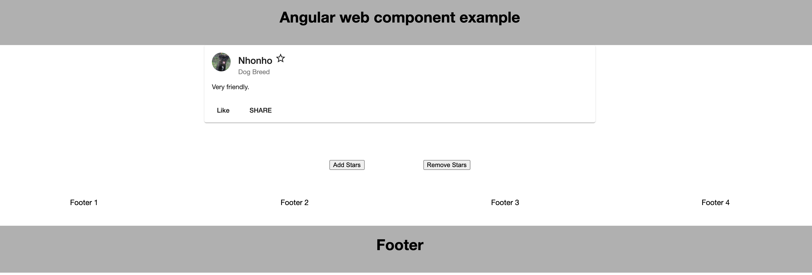

# Angular WebComponent Demo 1


### Generate web component

```
ng build --prod --output-hashing none
```


### Start Example

* Install server global

```
npm install -g serve
```

```

cd demo &&  serve

```


* http://localhost:5000/





